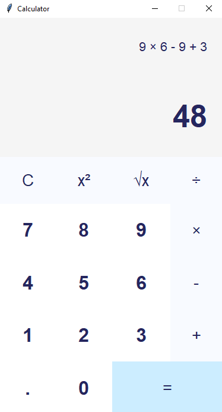

# Calculator App README

## Overview
This is a simple calculator application built with Python's `tkinter` library. It supports basic arithmetic operations, including addition, subtraction, multiplication, and division. The app also provides functionalities for squaring numbers and calculating square roots.


## Features
- **Basic Arithmetic**: Addition, subtraction, multiplication, and division.
- **Square and Square Root**: Buttons for squaring a number and taking the square root.
- **Clear and Equals**: Clear the current expression and evaluate it with the equals button.
- **Keyboard Support**: Enter digits, operators, and evaluate expressions using the keyboard.
- **Responsive UI**: Auto-resizable buttons and labels to fit different screen sizes.

## Project Structure
The main logic is encapsulated in the `Calculator` class. Key components include:

1. **Display Frame and Labels**: Shows the ongoing expression and the current result.
2. **Buttons**: Includes digit buttons, operator buttons, and special function buttons like Clear, Equals, Square, and Square Root.
3. **Event Bindings**: Allows keyboard inputs for numbers and operations.

## Code Breakdown
- **Styling Constants**: Predefined font styles, colors, and window dimensions.
- **Calculator Class**: Main application logic with the following methods:
  - `create_display_frame()` and `create_display_labels()`: Set up the display area.
  - `create_buttons_frame()`, `create_digit_buttons()`, and `create_operator_buttons()`: Generate button frames and configure button positions.
  - `bind_keys()`: Binds keys to functions, enabling keyboard inputs.
  - `create_special_buttons()`: Adds buttons for clearing, equals, square, and square root operations.
  - `evaluate()`, `square()`, `sqrt()`: Execute calculations based on user inputs.

## Usage
1. **Run the Application**: Launch the app by running the Python script.
   ```bash
   python calculator.py
   ```
2. **Use the Calculator**:
   - Enter numbers and operations using buttons or keyboard.
   - Press `Enter` or `=` to evaluate the expression.
   - Use the `C` button to clear the current input.

## Requirements
- **Python 3.x**
- **tkinter** (comes bundled with Python)

